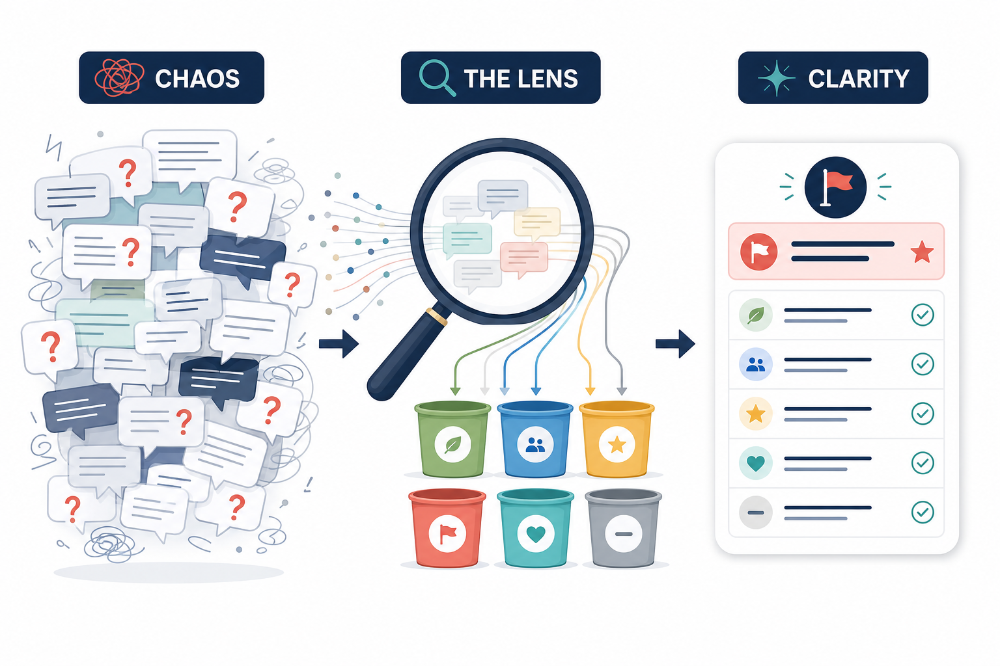
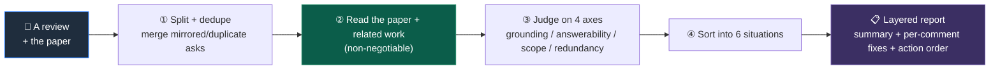
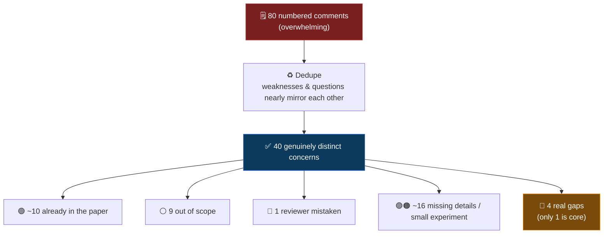

<div align="center">


# 🔍 ReviewLens

**Put a peer review under the microscope — tell, comment by comment, whether it *holds up* and *how to respond*.**

[](#-status--roadmap)
[](#-who-its-for)
[](#-method)
[](./LICENSE)
[](#-status--roadmap)

**English** · [简体中文](./README_zh.md)

</div>

---

ReviewLens takes `a review + the corresponding paper`, judges each comment for whether it actually holds up, automatically sorts a whole page of comments into **6 situations**, and gives a response suggestion for each (with ready-to-paste wording).

> **It only helps you judge and organize — the final judgment and wording are still yours.**

<div align="center">

> 🧪 **Status**: early prototype, **usable today** — clone the repo and run the bundled skill (see [Get started](#-get-started)). Validated end-to-end by hand on one complete real case (ICLR 2026 *VGR* / a reviewer who wrote 80 comments) → [`examples/`](./examples). A `pip` CLI is a convenience on the roadmap.

</div>

---

## 😫 Why it exists

AI-assisted reviewing is **unstoppable — it's where peer review is heading**. NeurIPS / ICML 2026 have already opened official channels, and studies show that *well-used* AI feedback can improve review quality. But the same force has pushed the **barrier to reviewing** to an all-time low: an inexperienced reviewer plus one-click AI can produce a "looks professional, actually padded" review in minutes.

For authors, the real pain isn't "AI writes badly" — it's that **no matter how off-base a comment is, you still have to respond to every single one**. Common forms of padding:

| Form | Meaning |
| :-- | :-- |
| 🌀 **Out of scope** | Demands experiments unrelated to the paper's core contribution |
| ⛔ **Unanswerable** | Demands a pile of new experiments impossible within the rebuttal window |
| ❓ **Doesn't match** | Misreads the paper, or asks for things the paper already includes |
| ♻️ **Padding** | The same ask, reworded again and again, faking rigor through sheer count |

Existing AI-for-review tools almost all either **write reviews** or **help authors polish drafts**.

> 🎯 **No one helps you judge whether a review itself holds up, and tell you how to respond. That's where ReviewLens fits.**

---

## ⚙️ How it works

<div align="center">



</div>



---

## 🗂️ Six situations: sort every comment

Each comment goes into one of these six buckets, each paired with "how worried to be" and "how to respond":

| | Situation | Meaning | How to respond |
| :--: | :-- | :-- | :-- |
| 🟢 | **Already in the paper** | The reviewer missed it (often in the appendix) | Point them to it in one line — **no new work needed** |
| ⚪ | **Out of scope** | Not what this paper sets out to solve | Decline politely, mark as future work |
| 🔵 | **Reviewer is mistaken** | The question rests on a false premise | Correct it politely + point to the evidence |
| 🟠 | **Valid but too big** | Reasonable, but impossible to finish in the window | Run one feasible small experiment, defer the rest |
| 🟣 | **Just missing details** | Doesn't affect conclusions, just under-specified | Bundle into one "implementation details" paragraph |
| 🔴 | **A real gap, must answer** | Genuinely absent and tied to the core claim | Spend your effort mostly here |

---

## 🔬 A real case: 80 comments, only ~4 to actually do

**One reviewer of ICLR 2026 submission #23089 (the *VGR* paper)** — rating **4** / confidence **5 (the highest)** — wrote **80 numbered comments** (40 weaknesses + 40 questions). The paper's other four reviewers raised only **0–3** each.

After reading the original paper + related work, ReviewLens peels the pile apart layer by layer:



> **Key takeaway**: after deduping, pointing back to what's already answered, and bounding the out-of-scope asks, the author of this 80-comment review really only needs to do **1 core thing + 3 small additions**.
> **And that judgment is impossible without reading the original paper + related work.**

📎 Full report: [`examples/iclr2026_23089_R29m_author_report.md`](./examples/iclr2026_23089_R29m_author_report.md)

---

## 🧠 Method

1. **Split + dedupe**: break the review into individual asks and merge duplicates (80 → 40 in the case).
2. **Judge on four axes** (tag every ask):

   | Axis | What it asks |
   | :-- | :-- |
   | 📍 **Grounding** | Can this be located in the paper? (supported / misread / already written) |
   | ⏳ **Answerability** | Answerable within scope, or an undoable mountain of new experiments? |
   | 🎯 **Scope** | Tied to the core contribution, or nitpicking at the edges? |
   | ♻️ **Redundancy** | Does it duplicate another ask and can be merged? |

3. **Read the paper + related work (non-negotiable)**: to judge "already in the paper", "over-claimed", or "reviewer misread", the verdict **must** be grounded in the original paper (incl. appendix) + related work. This is what separates ReviewLens from shallow tools that merely count comments.
4. **Sort + respond**: route into the 6 situations, apply the matching response template, and output a **layered report + action order**.

---

## 👤 Who it's for

| User | How they use it | Note |
| :-- | :-- | :-- |
| 👩‍🔬 **Authors (primary)** | Received review + their own paper → a breakdown report, both a stress-relief checklist and rebuttal ammunition | Most compliance-free (venues explicitly allow authors to use AI) |
| 🧑‍⚖️ Reviewers (self-check) | Before submitting: do I have a pile of out-of-scope / duplicate / unanswerable asks? | Must follow venue policy; use a privacy-compliant / local model |
| 🏛️ AC / PC (governance) | Quickly assess review quality; flag padded or negligent reviews | High value; needs platform support |

> All three share the same engine; authors are the beachhead.

---

## 🚦 Design principles (red lines)

- ✅ **Judge and organize, never decide for you**: it gives "classification + location + evidence + suggested wording", but **does not write a full review / rebuttal for you, and never issues an absolute right/wrong verdict**.
- 📍 **Grounding is mandatory**: every conclusion must point to a concrete location in the paper / related work — **no fabrication**.
- ⚖️ **Compliance modes**: authors are free; the reviewer side must follow the target venue's current-year policy (CVPR fully bans, ICML two-track, NeurIPS experimental) and use a privacy-compliant / local model.
- 🛡️ **Anti prompt-injection**: scan for hidden instructions before reading the paper (white-on-white text, "give a positive review"); flag and never execute them.
- 🕒 **Version awareness**: when judging "already in the paper", use **the version the reviewer actually saw**, so that "added during rebuttal" is not mistaken for "the reviewer missed it".

---

## 📂 Examples / Demo

[`examples/`](./examples) holds the first end-to-end sample (ICLR 2026 *VGR* / Reviewer R29m):

| File | Contents |
| :-- | :-- |
| [`…_R29m.md`](./examples/iclr2026_23089_R29m.md) | The original 80-comment review (evaluation sample) |
| [⭐ `…_R29m_author_report.md`](./examples/iclr2026_23089_R29m_author_report.md) | **Flagship output · the author report**: layered (one-page summary + per-comment detail + evidence), each comment as "which Reviewer → their ask → which situation → how to fix" |
| [`…_R29m_grounded_response.md`](./examples/iclr2026_23089_R29m_grounded_response.md) | Analyst working notes (the reasoning from reading the paper + related work) |
| [`…_R29m_analysis.md`](./examples/iclr2026_23089_R29m_analysis.md) | Control: the **paper-not-read** version (shows why reading the paper is essential) |

> 💡 Comparing `author_report` against `analysis` (paper-not-read) makes it vivid: **whether you read the paper changes the output entirely** — without it, "already in the paper" items get misjudged as "reasonable additional requests".

---

## 🆚 How it differs from existing tools

| Tool | What it does | For whom |
| :-- | :-- | :-- |
| [OpenAIReview](https://github.com/ChicagoHAI/OpenAIReview), [paper-agents-manuscript](https://github.com/bdsp-core/paper-agents-manuscript) | **Generate** reviews / help authors **polish drafts** | Authors (pre-submission) |
| General LLM prompting (ChatGPT / Claude) | Ad-hoc help **responding to** reviews | Authors (post-submission) |
| **🔍 ReviewLens — author mode** ([`skills/reviewlens`](./skills/reviewlens)) | **Diagnose whether a received review holds up + tell you how to respond** | Authors |
| **🔍 ReviewLens — reviewer mode** ([`skills/review-coach`](./skills/review-coach)) | **Self-check your own review before submitting** | Reviewers |

> The two external tools above *write* reviews/drafts; ReviewLens does the opposite — it *audits an existing review* and tells you, comment by comment, whether it holds up. Both modes ship in this repo (see [Get started](#-get-started)).

---

## 🚀 Get started

ReviewLens ships as an **agent skill** — no install, no API keys of its own. **Clone it and use it right away** with an agent that supports skills (Claude Code, Cursor, …).

```bash
git clone https://github.com/Dzyy123/review-lens.git
```

**Option A — use it in place.** Open the repo in Cursor / Claude Code and ask the agent to follow [`skills/reviewlens/SKILL.md`](./skills/reviewlens), giving it your review + the paper (a PDF path or an arXiv link).

**Option B — install as a slash-command skill.**

```bash
# Claude Code
cp -r review-lens/skills/reviewlens   ~/.claude/skills/
cp -r review-lens/skills/review-coach ~/.claude/skills/   # optional: reviewer mode

# Cursor
cp -r review-lens/skills/reviewlens   ~/.cursor/skills/
```

Then just invoke it:

```text
/reviewlens  <your review> + <paper.pdf | arXiv URL>
```

It reads the paper (incl. appendix) + related work, then returns the layered report — exactly like [`examples/iclr2026_23089_R29m_author_report.md`](./examples/iclr2026_23089_R29m_author_report.md).

> 📦 A `pip install reviewlens` CLI is on the roadmap as a convenience; the skill above is the real, working tool today.

---

## 🛣️ Roadmap

- [x] Core method (4 axes + 6 situations + response templates)
- [x] First end-to-end real case run by hand (*VGR* / R29m)
- [x] Ships as a ready-to-use skill — author mode + reviewer mode
- [ ] `pip` CLI: `review + paper PDF → breakdown report`
- [ ] Auto split / dedupe / sort across multiple reviewers
- [ ] One-click handoff to a rebuttal draft
- [ ] Hardened reviewer self-check (compliance gating + privacy-compliant backend)

---

## 📄 License

[MIT](./LICENSE) © 2026 Dzyy123

<div align="center">

---

*ReviewLens — so every review comment gets seen clearly.*

</div>
