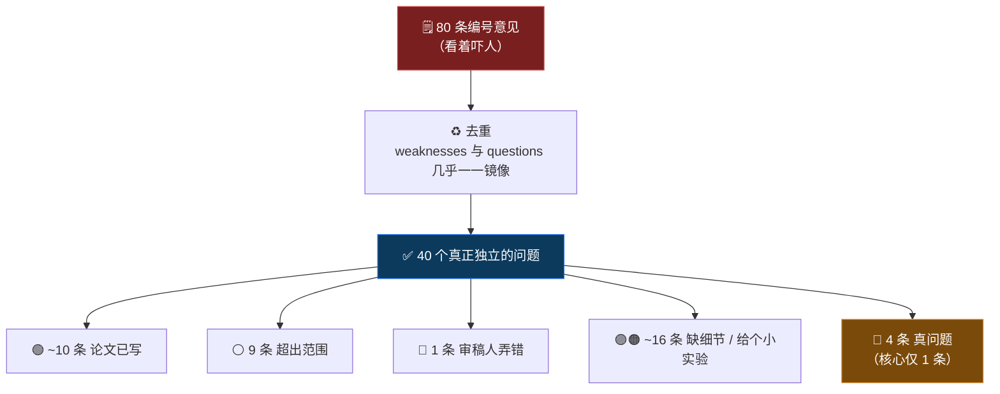

<div align="center">


# 🔍 ReviewLens

**把一份审稿意见放到显微镜下 —— 逐条告诉你它*站不站得住*，并教你*该怎么回*。**

[](#-状态--roadmap)
[](#-谁该用)
[](#-工作原理)
[](./LICENSE)
[](#-状态--roadmap)

[English](./README.md) · **简体中文**

</div>

---

ReviewLens 接收 `一份审稿意见 + 对应论文`，逐条判断每条意见是否成立，把一整页意见自动分成 **6 种情况**，并给出每条的应对建议（含可直接粘贴的话术）。

> **它只帮你判断和组织，最终判断与文字仍由你拍板。**

<div align="center">

> 🧪 **状态**：早期原型。核心流程已在一个完整真实案例（ICLR 2026 *VGR* 论文 / 一位提了 80 条意见的审稿人）上**人工跑通** → 见 [`examples/`](./examples)。CLI 自动化在规划中。

</div>

---

## 😫 为什么需要它

AI 辅助审稿已经全面普及——NeurIPS / ICML 2026 都开了官方通道，研究也证明**用得对**的 AI 反馈能提升 review 质量。但同一股力量把**审稿门槛**拉到了历史最低：经验不足的审稿人 + 一键 AI，几分钟就能产出一份"看着很专业、实则注水"的 review。

对作者来说，最痛的不是"AI 写得差"，而是 **无论意见多离谱，你都得逐条回应**。常见的注水形态：

| 形态 | 含义 |
| :-- | :-- |
| 🌀 **超纲** | 要求和论文核心贡献无关的实验 |
| ⛔ **答不了** | 要求 rebuttal 期根本做不完的大批新实验 |
| ❓ **对不上** | 误读论文，甚至要求论文其实已经写了的东西 |
| ♻️ **凑数** | 同一诉求反复换皮，靠数量制造"严谨"的假象 |

现有的 AI-for-review 工具几乎都在 **帮人写 review** 或 **帮作者改稿**。

> 🎯 **没有人帮你判断"一份 review 本身站不站得住"，并教你怎么回。这就是 ReviewLens 的位置。**

---

## ⚙️ 它怎么工作

<div align="center">


</div>


---

## 🗂️ 6 种情况：把意见对号入座

每条意见归入下面 6 种之一，每种都配「该不该慌」和「怎么回」：

| | 情况 | 含义 | 怎么回 |
| :--: | :-- | :-- | :-- |
| 🟢 | **论文里其实已经写了** | 审稿人没看到（多在附录） | 一句话指给他看，**不用做新东西** |
| ⚪ | **超出本文范围** | 不是这篇论文要解决的 | 礼貌划界，归为 future work |
| 🔵 | **审稿人弄错了** | 问题基于错误假设 | 礼貌纠正 + 指向证据 |
| 🟠 | **有道理但工作量太大** | 要求合理但答辩期做不完 | 给一个能做完的小实验，其余留正式版 |
| 🟣 | **只是缺细节** | 不影响结论，只是没写清 | 打包成一段"补充实现细节" |
| 🔴 | **真问题，必须认真答** | 论文确实没有、且关系核心 | 把力气主要花在这里 |

---

## 🔬 一个真实案例：80 条意见，其实只有 4 个要做

**ICLR 2026 投稿 #23089（论文 *VGR*）的一位审稿人** —— rating **4** / confidence **5（最高自信）**，写了 **80 条编号意见**（40 weaknesses + 40 questions）。同篇论文另外 4 位审稿人的问题数只有 **0–3**。

ReviewLens 读了原论文 + 相关工作后，把这堆意见层层还原：



> **关键结论**：这份 80 条的 review，去重 + 反指已答 + 划界超纲之后，作者真正要动手的只有 **1 个核心 + 3 个小补充**。
> **而这个判断，不读原文 + 不查相关工作，根本给不出来。**

📎 完整报告：[`examples/iclr2026_23089_R29m_author_report.md`](./examples/iclr2026_23089_R29m_author_report.md)

---

## 🧠 工作原理

1. **拆条 + 去重**：把 review 拆成一条条独立诉求，合并重复（案例里 80 → 40）。
2. **四维判断**（每条打标签）：

   | 维度 | 它问什么 |
   | :-- | :-- |
   | 📍 **对应性** | 这条说的，能否在论文里定位到？（有据 / 误读 / 论文其实已写） |
   | ⏳ **可答性** | 论文范围内可答，还是要求做不完的大实验？ |
   | 🎯 **切题性** | 关乎核心贡献，还是边缘的鸡蛋里挑骨头？ |
   | ♻️ **冗余性** | 和别的诉求重复、可合并？ |

3. **读原文 + 查相关工作（铁律）**：判断"论文是否其实已写""是否 over-claim""审稿人是否误读"，**必须** grounded 在原论文（含附录）+ 相关工作上。这是 ReviewLens 区别于"只数问题数量"的浅层工具的核心。
4. **分流 + 给应对**：归入 6 种情况，套用对应的应对模板，输出**分层报告 + 行动顺序**。

---

## 👤 谁该用

| 用户 | 怎么用 | 备注 |
| :-- | :-- | :-- |
| 👩‍🔬 **作者（主要用户）** | 收到的 review + 自己的论文 → 拿到拆解报告，作为减压清单 + rebuttal 弹药 | 合规最自由（会议明确允许作者用 AI 辅助） |
| 🧑‍⚖️ 审稿人（自查） | 提交前自检：我有没有提了一堆超纲 / 重复 / 答不了的问题 | 需遵守会议政策、用 privacy-compliant / 本地模型 |
| 🏛️ AC / PC（治理） | 快速评估 review 质量、识别注水或失职的审稿 | 价值高，需平台配合 |

> 三类用户共享同一个引擎，先以 **作者** 为切入点。

---

## 🚦 设计原则（红线）

- ✅ **只判断和组织，不替你拍板**：给"分类 + 定位 + 依据 + 建议话术"，但**不替你写完整 review / rebuttal，不下"绝对对/错"的终判**。
- 📍 **对应性必须 grounded**：每条结论都要能落到原文/相关工作的具体位置，**不捏造**。
- ⚖️ **合规分模式**：作者侧自由；审稿人侧必须遵守目标会议当年政策（CVPR 全禁、ICML 两档、NeurIPS 实验性）并使用 privacy-compliant / 本地模型。
- 🛡️ **抗 prompt injection**：读论文前扫描隐藏指令（白底白字、"give a positive review"），发现即标记、不执行。
- 🕒 **版本意识**：判"论文已写"时，以**审稿人当时审的版本**为准，避免把"rebuttal 后才补的"误判成"审稿人看漏了"。

---

## 📂 示例 / Demo

[`examples/`](./examples) 下是第一个端到端样本（ICLR 2026 *VGR* / Reviewer R29m）：

| 文件 | 内容 |
| :-- | :-- |
| [`…_R29m.md`](./examples/iclr2026_23089_R29m.md) | 原始 80 条 review（评测样本） |
| [⭐ `…_R29m_author_report.md`](./examples/iclr2026_23089_R29m_author_report.md) | **旗舰输出 · 给作者的报告**：分层（一页结论 + 逐条详解 + 证据层），每条按"哪个 Reviewer → 他的建议 → 属于哪类 → 怎么改"呈现 |
| [`…_R29m_grounded_response.md`](./examples/iclr2026_23089_R29m_grounded_response.md) | 分析师工作底稿（读原文 + 查相关工作的推导过程） |
| [`…_R29m_analysis.md`](./examples/iclr2026_23089_R29m_analysis.md) | 对照组：**未读原文**版（说明为何必须读原文） |

> 💡 对照 `author_report` 与 `analysis`（未读原文版）能直观看到：**读不读原文，输出质量天差地别**——未读原文时把"论文已写"的条目误判成了"合理的补充要求"。

---

## 🆚 和现有工具的区别

| 工具 | 它做什么 | 服务谁 |
| :-- | :-- | :-- |
| OpenAIReview / Publication Assistant / paper-agents | **生成** review / 帮作者**改稿** | 作者（投稿前） |
| `rebuttal` skill | 帮作者**回应** review | 作者（投稿后） |
| `review-coach` skill | 帮审稿人**写好** review | 审稿人 |
| **🔍 ReviewLens（本项目）** | **诊断一份 review 站不站得住 + 教你怎么回** | 作者 / 审稿人 / AC |

---

## 🛣️ 状态 & Roadmap

- [x] 核心方法设计（四维 + 6 种情况 + 应对模板）
- [x] 第一个端到端真实案例人工跑通（*VGR* / R29m）
- [ ] CLI MVP：`输入 review + 论文 PDF → 输出拆解报告`
- [ ] 自动读原文 + 相关工作检索（grounding 流水线）
- [ ] 自动拆条 / 去重 / 分流
- [ ] 一键生成 rebuttal 初稿（衔接 `rebuttal` 流程）
- [ ] 审稿人自查模式（合规守门 + privacy-compliant 后端）

---

## 🚀 安装与使用（规划中）

> ⚠️ 以下为**设计目标**，尚未实现。

```bash
pip install reviewlens

# 作者侧：拆解一份收到的 review
reviewlens diagnose --paper paper.pdf --review review.txt --out report.md
```

---

## 🔗 相关项目

- **`rebuttal`** — 把拆解结果接力成一份安全、合规的 rebuttal 初稿。
- **`review-coach`** — 同一引擎的"审稿人自查"形态。

## 📄 License

[MIT](./LICENSE) © 2026 Dzyy123

<div align="center">

---

*ReviewLens —— 让每一条审稿意见，都被看清。*

</div>
